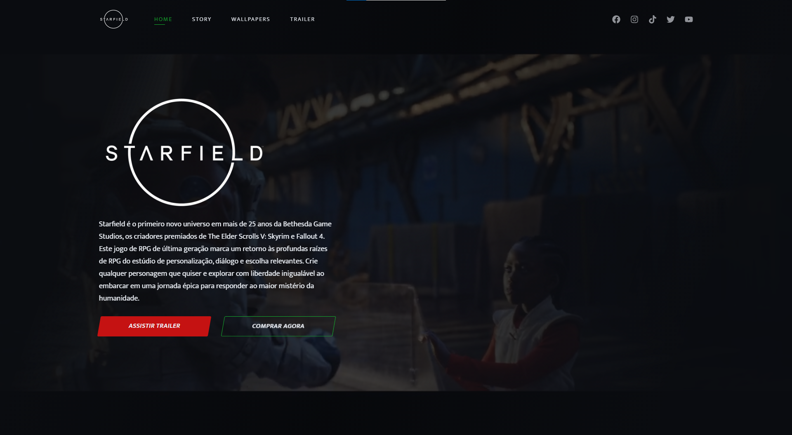

<h1 align="center">
  Site do jogo Starfield
</h1>

  

## 💻 Projeto

Este projeto do **Starfield** foi criado com intuito apenas de estudar propriedades do CSS e aprimorar a forma de estruturar o HTML.

## 🚀 Tecnologias

- HTML
- CSS
- [AOS Animate](https://michalsnik.github.io/aos/)

## 📔 Tópicos de estudo

- [x] Uso semântico do HTML
- [x] Carregamento de video no background
- [x] Váriaveis do css no `:root`
- [x] Animações com a biblioteca [AOS](https://michalsnik.github.io/aos/)
- [x] Uso do CSS Flexbox
- [x] Efeitos com a propriedade `transform` do css
